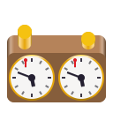

## Notice! Seeking maintainers

Chess Clock's creator has left the GNOME Foundation and is looking to step away
from the project.  If you are interested in maintaining Chess Clock, please open
an issue to let me know!

# Chess Clock

Chess Clock is a simple application to provide time control for over-the-board
chess games.  Intended for mobile use, players select the time control settings
desired for their game, then the black player taps their clock to start white's
timer.  After each player's turn, they tap the clock to start their opponent's,
until the game is finished or one of the clocks reaches zero.

## Installing

Installation via Flathub is recommended.

## Contributing

To contribute to Chess Clock, please see the [CONTRIBUTING.md](CONTRIBUTING.md)
file.

## Code of Conduct

Chess Clock follows the GNOME
[Code of Conduct](https://wiki.gnome.org/Foundation/CodeOfConduct).  Everyone
is expected to observe this code in all project spaces.
